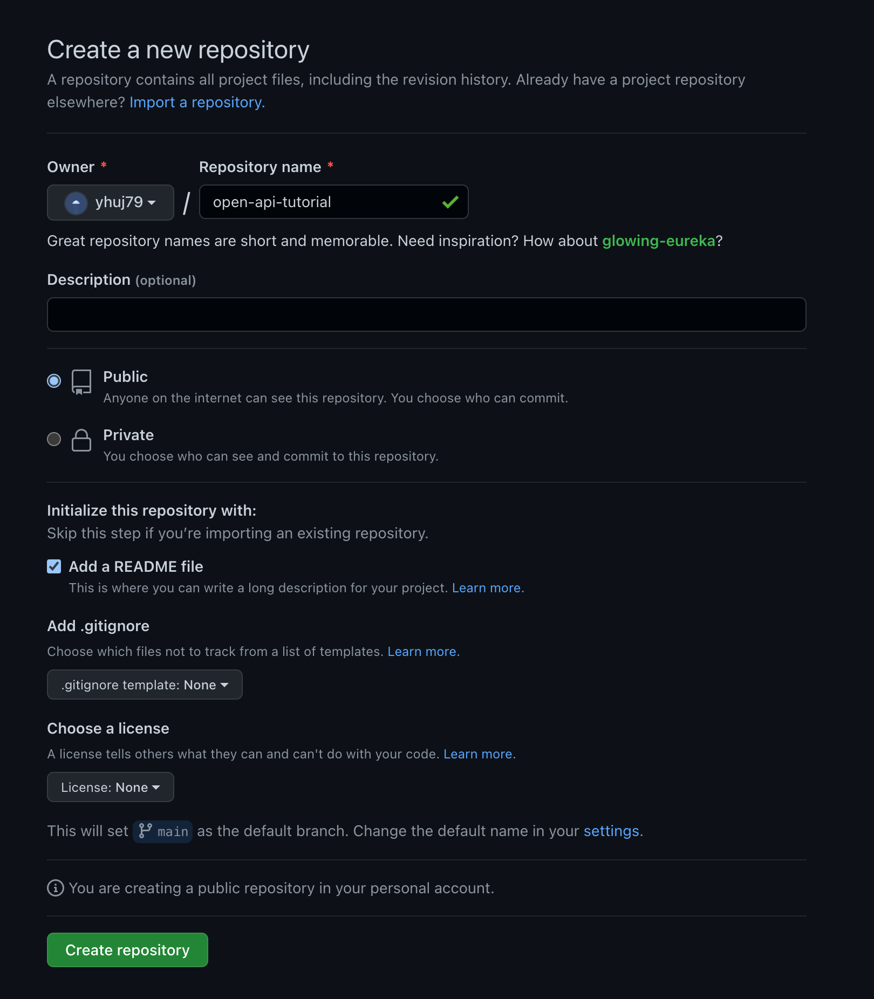
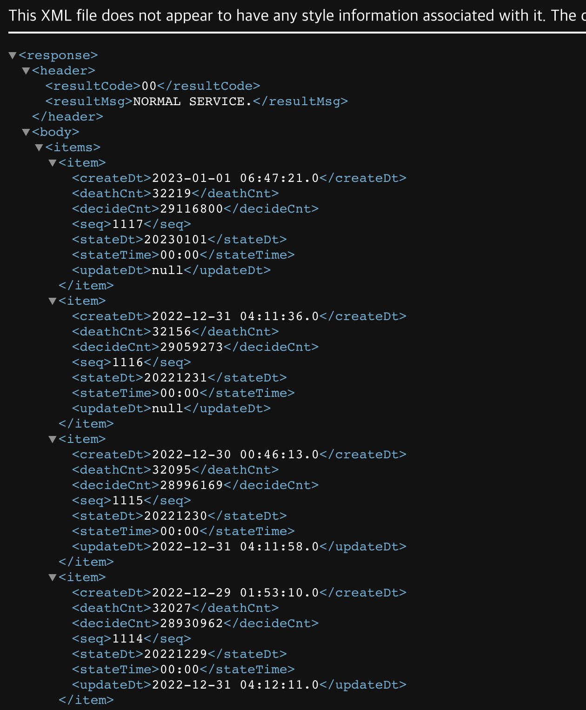
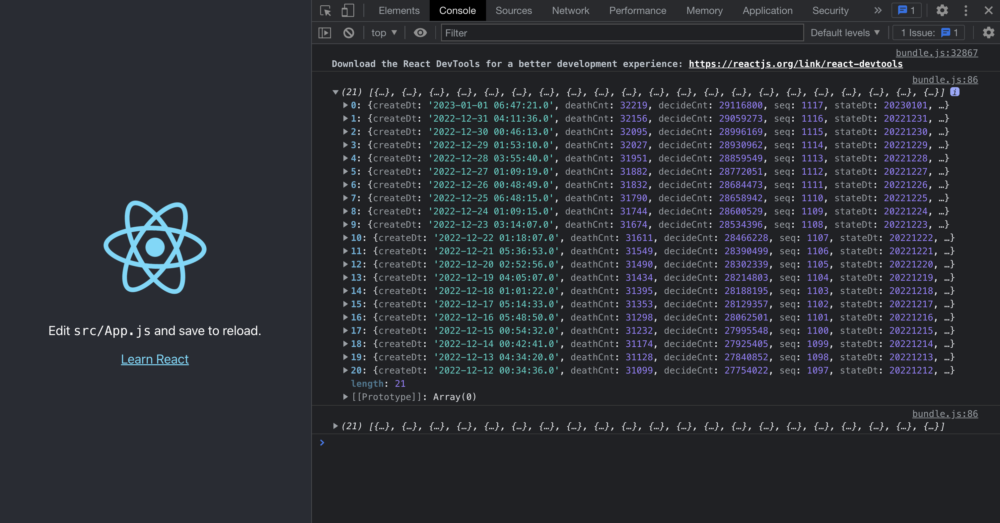
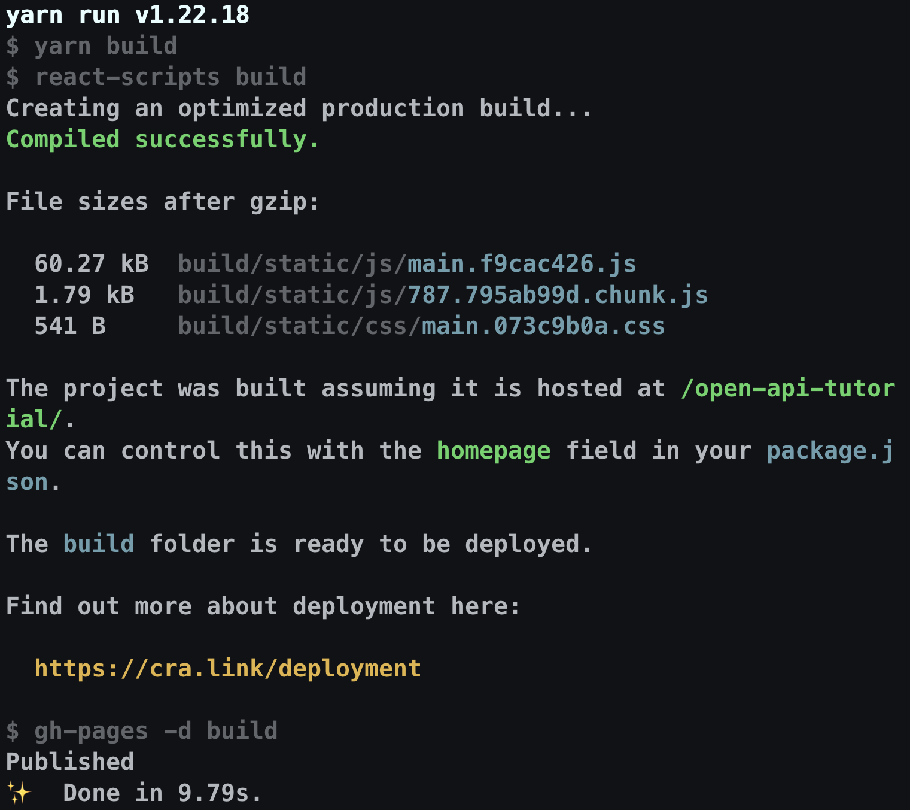
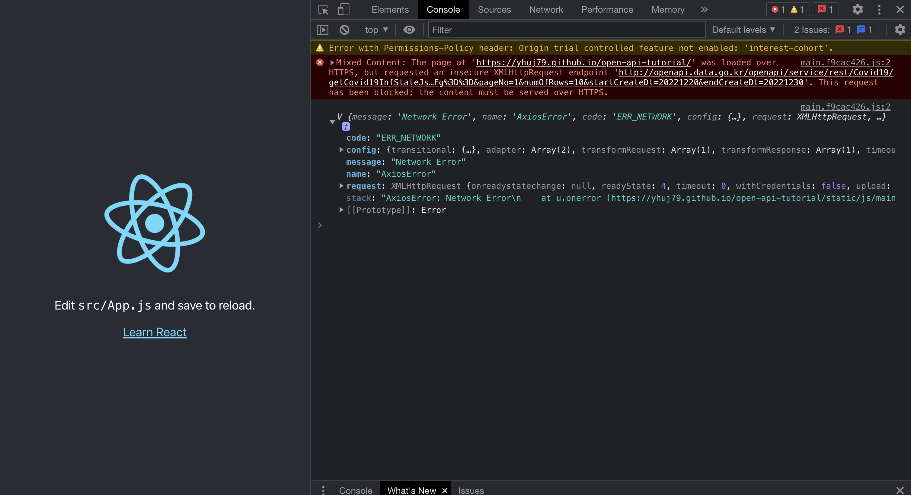
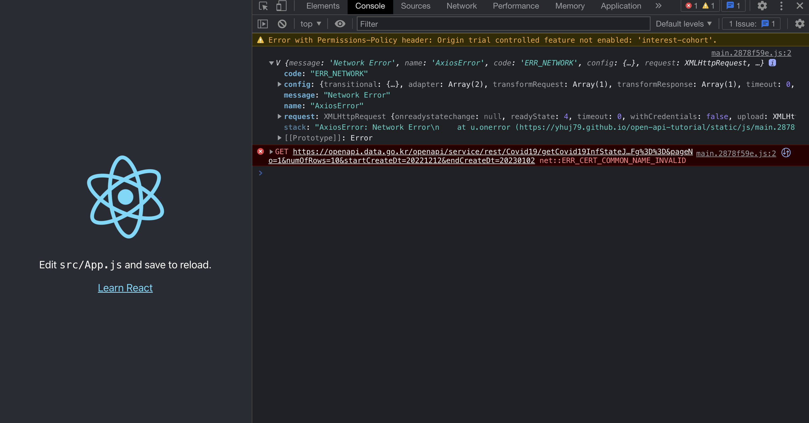
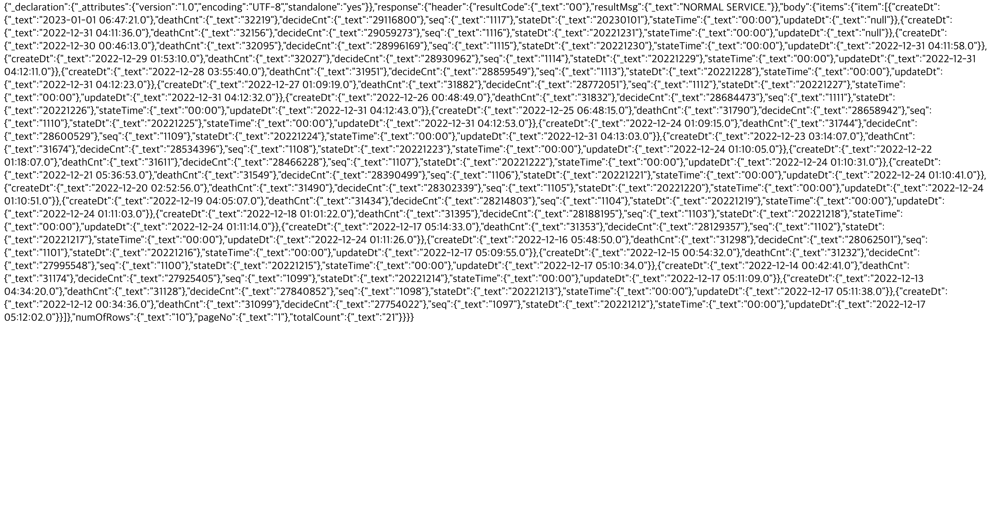
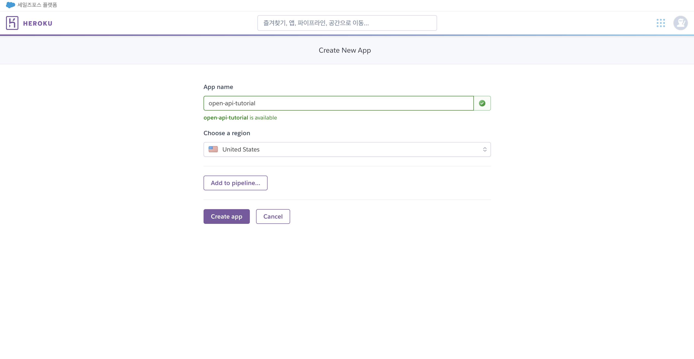
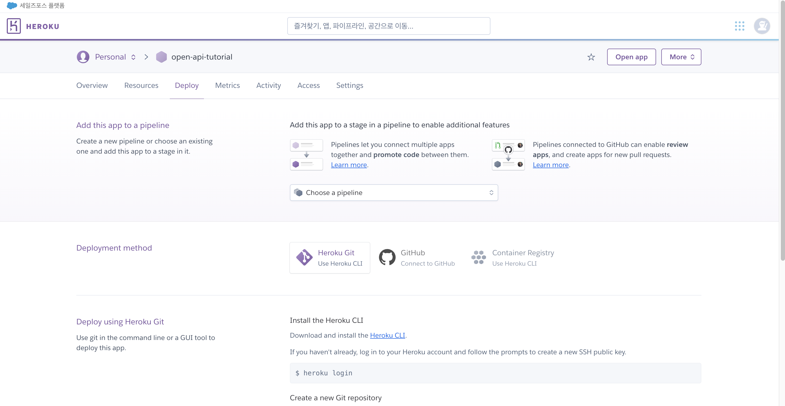
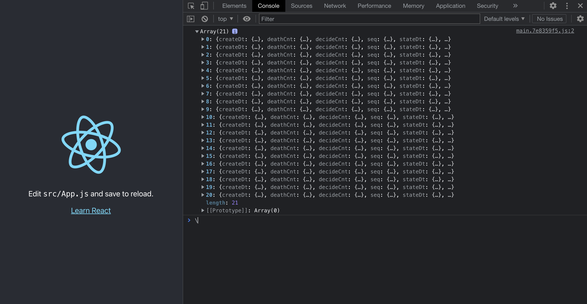

## XML 형식의 Open API

예전 프로젝트에서 <a href="https://www.data.go.kr" target="_blank">공공데이터포털</a>에 있는 **XML(Extensible Markup Language)** 형식의 API를 다룬 적이 있다. 데이터를 이용하여 원하는 형태로 구현하는 것 까지는 문제가 없었지만, **GitHub Page**, **Vercel** 등으로 프로젝트를 배포했을 경우 갖가지 문제에 부딪혔다. 특히 공공데이터포털에서 제공하는 API는 대다수가 XML 형식으로 되어 있다. 이 문제의 해결법은 아래에 설명해 놓은 방법만이 정답인 것은 아니겠지만 비교적 괜찮은 방법으로 성공한 것 같다.

**GitHub**에 새 저장소를 만들고, 생성한 저장소를 클론 후 `react-app`을 만들었다.



```bash
$ git clone https://github.com/(github-id)/open-api-tutorial.git
$ cd open-api-tutorial
$ yarn create react-app open-api-tutorial
```

생성한 react-app에서 `axios`를 설치한다.

```bash
$ cd open-api-tutorial
$ yarn add axios
```

공공데이터포털에서 제공하는 국내 코로나 바이러스 현황을 받아볼 수 있는 API를 사용하였다.<br>
<a href="https://www.data.go.kr/bbs/ntc/selectNotice.do?originId=NOTICE_0000000002849" target="_blank">공공데이터활용지원센터_보건복지부 코로나19 감염 현황 (현재 폐기됨)</a>

**XML**은 **Extensible Markup Language** 의 약자로, HTML과 비슷한 구조를 가진다.



App.js에서 데이터를 콘솔에 출력하였다. 이 API는 **startCreateDt**, **endCreateDt** 파라미터로 데이터 범위를 지정할 수 있는데, `Moment.js`, `Day.js`와 같은 라이브러리를 사용하면 현재 날짜를 받아서 원하는 기간의 데이터를 받아볼 수 있다. 우선 테스트를 위해 날짜 라이브러리는 사용하지 않고 임의의 날짜를 입력해 주었다.

```javascript
// src/App.js
import logo from "./logo.svg";
import "./App.css";
import { useEffect } from "react";
import axios from "axios";

function App() {
  useEffect(() => {
    const fetchData = async () => {
      try {
        const res = await axios.get(`http://openapi.data.go.kr/openapi/service/rest/Covid19/getCovid19InfStateJson?serviceKey=${process.env.REACT_APP_API_KEY}&pageNo=1&numOfRows=10&startCreateDt=20221212&endCreateDt=20230103`);
        console.log(res.data.response.body.items.item);
      } catch (e) {
        console.log(e);
      }
    };
    fetchData();
  }, []);

  return (
    <div className="App">
      <header className="App-header">
        
        <p>
          Edit <code>src/App.js</code> and save to reload.
        </p>
        <a
          className="App-link"
          href="https://reactjs.org"
          target="_blank"
          rel="noopener noreferrer"
        >
          Learn React
        </a>
      </header>
    </div>
  );
}

export default App;
```

react-app에 `.env`파일을 생성하고 다음과 같이 API KEY를 입력한다. GitHub에 `.env`파일이 올라가지 않게 `.gitignore`에 .env도 추가한다.

```bash
# .env
REACT_APP_API_KEY=APIKEY입력하는곳

# .gitignore
...
...
.env
```

`yarn start`로 실행시켜 확인하면 다음과 같이 지정한 범위의 코로나 데이터를 확인할 수 있다.<br>
(콘솔에 두 번 출력되는 이유는 React의 **StrictMode** 때문이다.)



작성한 그대로 **GitHub Page**에 배포하여 확인해 보자. `gh-pages`를 설치한다.

```bash
$ yarn add --dev gh-pages
```

`package.json` 내용을 추가 후, `build`, `deploy`를 하고 나면<br>
`https://(github-id).github.io/open-api-tutorial`에서 페이지를 확인할 수 있다.

```json
// package.json scripts에 추가
"predeploy": "yarn build",
"deploy": "gh-pages -d build"

// package.json에 따로 추가
"homepage": "https://(github-id).github.io/open-api-tutorial"
```

```bash
$ yarn build
$ yarn deploy
```



페이지는 잘 나타났으나 데이터에서 `Mixed Content Error`가 발생한다.



암호화된 HTTPS 페이지에 암호화되지 않은 HTTP를 통해 요청할 때 발생하는 에러라고 한다.<br>
public/index.html에 HTTPS 변환 메타태그를 추가 후 다시 확인해 보면...

```html
<meta http-equiv="Content-Security-Policy" content="upgrade-insecure-requests" />
```



`ERR_CERT_COMMON_NAME_INVALID` 에러가 등장했다. SSL 인증서 관련 문제라고 한다. 이 프로젝트에서는 HTTPS 변환된 API가 존재하지 않아 에러가 발생했다는 뜻으로 보여진다.

따라서 다른 방법으로 구상한 게 웹 서버에 데이터를 파싱 후 웹 앱에 뿌리는 것이다.

## Express Web Server

프로젝트 디렉터리에 server 디렉터리를 만들고 다음 라이브러리들을 설치했다.

```bash
$ yarn add express  # Node.js 서버 프레임워크
$ yarn add request  # HTTP 네트워크 요청
$ yarn add xml-js   # XML JSON 변환
$ yarn add cors     # Node.js CORS middleware
$ yarn add dotenv   # Node.js에서 환경변수 사용
```

server.js와 환경 변수 파일을 작성한다. react-app처럼 `.gitignore`을 만들고 `node_modules` , `.env`를 추가한다.

```javascript
// server/server.js
require("dotenv").config();
const express = require("express");
const app = express();
const cors = require("cors");
const request = require("request");
const convert = require("xml-js");
const PORT = process.env.PORT || 5000;

app.use(cors());

app.get("/api/data", (req, res) => {
  request(
    {
      url: `http://openapi.data.go.kr/openapi/service/rest/Covid19/getCovid19InfStateJson?serviceKey=${process.env.REACT_APP_API_KEY}&pageNo=1&numOfRows=10&startCreateDt=20221212&endCreateDt=20230103`,
      method: "GET",
    },
    (error, response, body) => {
      const xmlToJson = convert.xml2json(body, { compact: true, space: 4 }); // xml to json
      res.send(xmlToJson);
    }
  );
});

app.listen(PORT, () => {
  console.log(`Listening on port ${PORT}`);
});
```

```bash
# .env
REACT_APP_API_KEY=APIKEY입력하는곳

# .gitignore
.env
/node_modules
```

터미널에서 server 디렉터리로 이동, `node server.js`를 실행하면 5050포트로 서버가 실행된다. `http://localhost:5050/api/data`에서 API를 확인할 수 있다.



코드 수정 시 서버 재부팅이 귀찮기 때문에 `nodemon`을 설치하고, 명령어 간소화를 위해 `package.json`에 `scripts`를 추가한다.

```bash
$ yarn add nodemon
```

```json
// server/package.json
  "scripts": {
    "dev": "nodemon server.js"
  }
```

이제 `yarn dev` 명령어로 서버를 실행시킬 수 있다.

## Heroku

**Heroku**는 여러 프로그래밍 언어를 지원하는 클라우드 <a href="https://azure.microsoft.com/ko-kr/resources/cloud-computing-dictionary/what-is-paas" target="_blank">PaaS</a>로, 백엔드 서버를 이 플랫폼에 배포하려 한다. 최근 무료 서비스가 중단되었는데, 학생 개발자 프로그램으로 플랫폼 크레딧을 지급받을 수 있었다.

<a href="https://dashboard.heroku.com/apps" target="_blank">Heroku Dashboard</a>

우측 상단 NEW 버튼 > Create new app > 앱 이름 입력 > Create App





작성했던 server와의 연결에 앞서 server 디렉터리에 `Procfile`을 생성하고 다음과 같이 작성한다. Procfile을 읽은 헤로쿠가 `yarn dev`를 실행하고 yarn dev는 위에서 package.json에 작성했던 `nodemon server.js`를 실행하게 되는 구조다.

```c
// server/Procfile
web: yarn dev
```

터미널에서 Heroku를 설치한다. Mac을 사용중이기 때문에 `homebrew`로 설치하였다.

```bash
# Mac
$ brew install heroku/brew/heroku

# Windows
npm install -g heroku
```

로그인 후, server 디렉터리에서 Heroku Server에 연결한다.

```bash
$ heroku login

# /server
$ git init
$ heroku git:remote -a open-api-tutorial
```

Heroku에 환경 변수를 전송하려면 `heroku-dotenv`를 설치해야 한다. 설치 후 push하면 `.env`의 `REACT_APP_API_KEY`가 온전하게 적용된다.

```bash
$ yarn add heroku-dotenv
$ heroku-dotenv push
```

이제 작성한 server의 코드를 `commit`, `push`하면 Heroku Deploy가 완료된다.

```bash
$ git add .
$ git commit -am "heroku open-api-tutorial"
$ git push heroku master
```

`https://open-api-tutorial.herokuapp.com/api/data`에서 데이터를 확인할 수 있다.<br>
이렇게 재가공된 API가 만들어졌다.


이제 Heroku의 데이터를 받아서 콘솔에 출력한다.<br>
다시 GitHub Page에 배포하고 확인해보면 문제없이 잘 작동하는 것을 볼 수 있다.

```javascript
// src/App.js
...
...

  useEffect(() => {
    const fetchData = async () => {
      try {
        const res = await axios.get(
          `https://open-api-tutorial.herokuapp.com/api/data`
        );
        console.log(res.data.response.body.items.item);
      } catch (e) {
        console.log(e);
      }
    };
    fetchData();
  }, []);

...
...
```



## References

[https://velog.io/@vvsogi/%EA%B3%B5%EA%B3%B5-%EB%8D%B0%EC%9D%B4%ED%84%B0-API-React%EC%97%90%EC%84%9C-XML%EC%97%90%EC%84%9C-JSON-%EB%B3%80%ED%99%98](https://velog.io/@vvsogi/%EA%B3%B5%EA%B3%B5-%EB%8D%B0%EC%9D%B4%ED%84%B0-API-React%EC%97%90%EC%84%9C-XML%EC%97%90%EC%84%9C-JSON-%EB%B3%80%ED%99%98)

[https://medium.com/harrythegreat/node-js%EC%97%90%EC%84%9C-request-js-%EC%82%AC%EC%9A%A9%ED%95%98%EA%B8%B0-28744c52f68d](https://medium.com/harrythegreat/node-js%EC%97%90%EC%84%9C-request-js-%EC%82%AC%EC%9A%A9%ED%95%98%EA%B8%B0-28744c52f68d)

[https://azure.microsoft.com/ko-kr/resources/cloud-computing-dictionary/what-is-paas](https://azure.microsoft.com/ko-kr/resources/cloud-computing-dictionary/what-is-paas)

[https://krpeppermint100.medium.com/devops-react-express-%EC%95%B1-%EB%B0%B0%ED%8F%AC%ED%95%98%EA%B8%B0-netlify-heroku-b238e057d920](https://krpeppermint100.medium.com/devops-react-express-%EC%95%B1-%EB%B0%B0%ED%8F%AC%ED%95%98%EA%B8%B0-netlify-heroku-b238e057d920)
